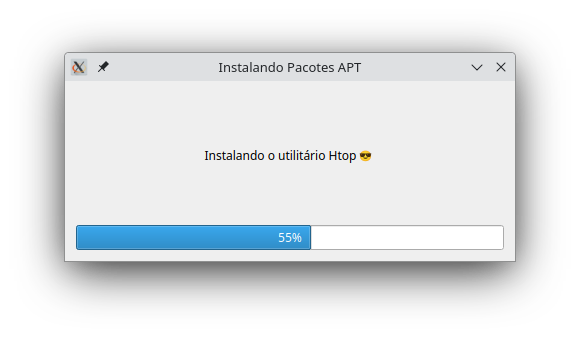

# 🧩 deb-manager-gui — Instalador e Removedor APT com Interface Gráfica (PyQt6)

Este é um gerenciador gráfico de pacotes APT feito em Python usando **PyQt6**, que permite **instalar e remover** pacotes diretamente do repositório ou arquivos `.deb` locais, com **barra de progresso**, **mensagem personalizada** e sem necessidade de clicar: basta executar com os argumentos corretos.

 

## 🛠️ Funcionalidades

- Interface gráfica moderna com **Qt6** (via PyQt6)
- Instalação e remoção de pacotes APT via terminal
- Suporte à instalação de arquivos `.deb` locais com `--deb`
- Progresso visual durante o processo
- Mensagens de sucesso ou erro exibidas ao final
- Mensagens personalizadas com `--tx`
- Usa `pkexec` (não precisa abrir o terminal como root diretamente)
- Permite múltiplos pacotes ao mesmo tempo

## 📦 Requisitos

- Python 3.x
- Sistema baseado em **Debian/Ubuntu**
- PyQt6:

  ```bash
  sudo apt install python3-pyqt6
  ```

## 🚀 Como usar

### 🔗 Clonar o repositório

```bash
git clone https://github.com/selrahcsan/deb-manager-gui.git
cd deb-manager-gui
chmod +x deb-manager-gui
```

### ▶️ Executar com `pkexec`

#### ✅ Instalar pacotes do APT:

```bash
pkexec env DISPLAY=$DISPLAY XAUTHORITY=$XAUTHORITY ./deb-manager-gui --in htop neofetch
```

#### ❌ Remover pacotes:

```bash
pkexec env DISPLAY=$DISPLAY XAUTHORITY=$XAUTHORITY ./deb-manager-gui --rm htop
```

#### 📦 Instalar arquivo `.deb` local:

```bash
pkexec env DISPLAY=$DISPLAY XAUTHORITY=$XAUTHORITY ./deb-manager-gui --deb ./google-chrome-stable_current_amd64.deb
```

#### 📝 Usar mensagem personalizada:

```bash
pkexec env DISPLAY=$DISPLAY XAUTHORITY=$XAUTHORITY ./deb-manager-gui --in htop --tx "Instalando utilitários do sistema"
```

## 📄 Argumentos disponíveis

| Argumento     | Descrição                                          |
|---------------|----------------------------------------------------|
| `--in`        | Instala um ou mais pacotes do repositório APT     |
| `--rm`        | Remove um ou mais pacotes instalados               |
| `--deb`       | Instala um ou mais arquivos `.deb` locais          |
| `--tx`        | Mensagem personalizada exibida na interface        |

## 🧪 Exemplo avançado

Instalar o `rar` e `zip` com uma mensagem personalizada:

```bash
pkexec env DISPLAY=$DISPLAY XAUTHORITY=$XAUTHORITY ./deb-manager-gui --in rar zip --tx "Instalando descompactadores"
```
