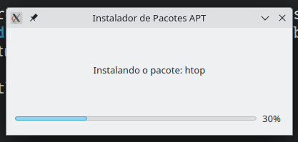

# Instalador APT com Interface Gráfica

Este é um instalador gráfico simples feito em Python usando ~~**Tkinter**~~ **PyQT**, que permite instalar pacotes `.deb` ou pacotes APT diretamente via nome, com barra de progresso e status.

 <!-- você pode colocar um link para um print da interface aqui -->

## 🛠️ Funcionalidades

- Interface gráfica amigável usando ~~tkinter~~ ~~QT5~~`QT6`
- Instala pacotes do repositório APT via nome (`apt install`)
- Exibe progresso simulado e status textual durante a instalação
- Usa ~~sudo~~`pkexec`, portanto, exige privilégios de administrador
- Mostra mensagens de sucesso ou erro após a instalação
- Personalização da mensagem da interface com `--tx`
  
## 📦 Requisitos

- Python 3.x
- Sistema baseado em Debian/Ubuntu
- Dependências Python (geralmente já incluídas):
  - `PyQT` -> `sudo apt install python3-pyqt6`

## ⚙️ Recursos incluídos

- Instalação automática ao iniciar
- Interface Qt (PyQt6)
- Barra de progresso
- Notificação ao final

## 🚀 Como usar

### 🔗 Clone o repositório

```bash
git clone https://github.com/selrahcsan/deb-manager-gui.git
cd deb-manager-gui
chmod +x deb-manager-gui.py
```

### 🏃‍➡️ Execute o script via terminal com privilégios administrativos

#### Instalar pacotes

```bash
pkexec env DISPLAY=$DISPLAY XAUTHORITY=$XAUTHORITY $PWD/./deb-manager-gui --in htop neofetch
```

#### Remover pacotes

```bash
pkexec env DISPLAY=$DISPLAY XAUTHORITY=$XAUTHORITY $PWD/./deb-manager-gui --rm htop
```

#### Com mensagem personalizada

```bash
pkexec env DISPLAY=$DISPLAY XAUTHORITY=$XAUTHORITY python3 $PWD/./deb-manager-gui --in htop --tx "Instalando o utilitário Htop"
```
