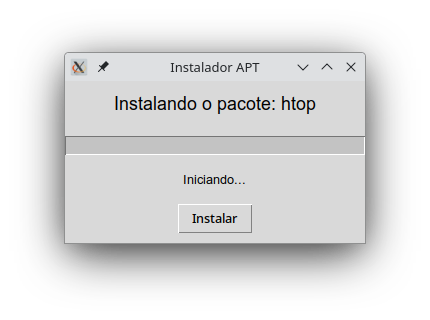

# Instalador APT com Interface Gráfica

Este é um instalador gráfico simples feito em Python usando **Tkinter**, que permite instalar pacotes `.deb` ou pacotes APT diretamente via nome, com barra de progresso e status.

 <!-- você pode colocar um link para um print da interface aqui -->

## 🛠️ Funcionalidades

- Interface gráfica amigável usando `tkinter`
- Instala pacotes do repositório APT via nome (`apt install`)
- Exibe progresso simulado e status textual durante a instalação
- Usa `sudo`, portanto, exige privilégios de administrador
- Mostra mensagens de sucesso ou erro após a instalação

## 📦 Requisitos

- Python 3.x
- Sistema baseado em Debian/Ubuntu
- Dependências Python (geralmente já incluídas):
  - `tkinter`
  - `ttk`
  - `subprocess`
  - `threading`

## 🚀 Como usar

Execute o script via terminal, passando o nome do pacote a ser instalado:

```bash
sudo python3 deb-install-gui.py <nome-do-pacote>
```
